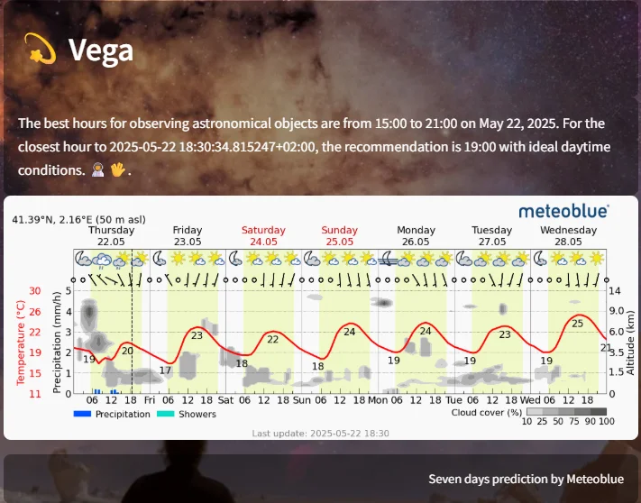
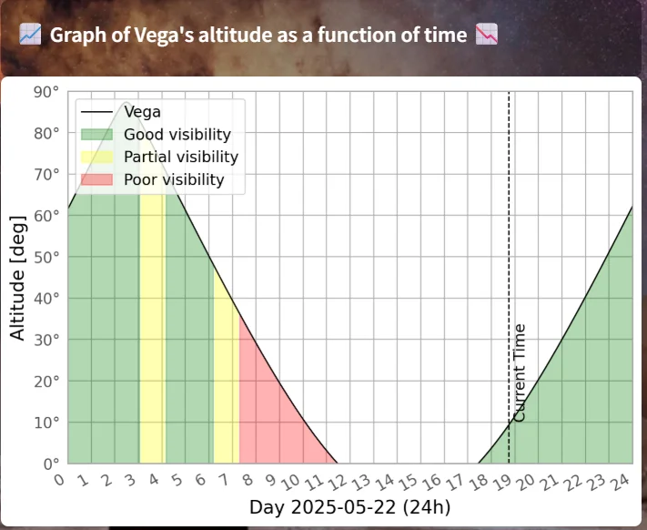
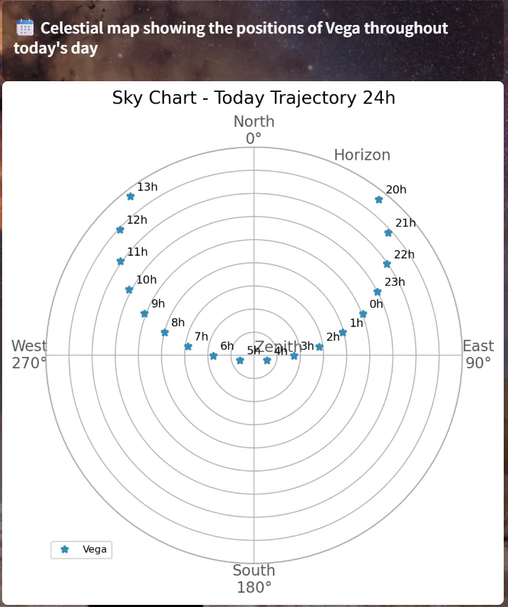

# 🌌 Astrazeus: Interactive Astronomy with Streamlit

An interactive application developed as part of the Master's Thesis in Data Science & Artificial Intelligence. This tool allows users to explore the visibility of astronomical objects based on their location, time, and weather conditions.

## 🚀 Features

- 🌍 Customizable location: Users can input latitude, longitude, and altitude to determine what celestial objects are visible from their position.

- 🕒 Hourly visibility calculation: Divide the day into time intervals to evaluate the visibility of an astronomical object hour by hour.

- ☁️ Real weather integration: Includes parameters such as cloud cover and sunlight to refine predictions.

- 💐 Celestial plots: Polar plots showing altitude and azimuth of celestial objects throughout the day.

## 🧑‍💻 Technologies Used

- `Python 3.10+`

- `Streamlit` for the interactive web interface

- `Astropy`, `Skyfield` for astronomical calculations

- `Matplotlib`, `Plotly` for sky visualizations

- `pandas`, `numpy` for data processing

- `requests` for accessing external weather and visibility APIs

- `scikit-learn` for user recommendations

## 📁 Project Structure

```
astrazeus/
├── images/
│ ├── background_picture/
│ │ ├── apod_1_8_24_petr_horálek.webp
│ │ ├── apod_1_12_23_josé_rodrigues.webp
│ │ ├── apod_5_8_24_makrem_larnaout.webp
│ │ ├── apod_9_2_25_michael_goh.webp
│ │ ├── apod_10_5_23_amr_abdulwahab.webp
│ │ ├── apod_26_5_24_marcin_rosadziński.webp
│ │ ├── apod_27_12_23_stefano_pellegrini.webp
│ │ ├── apod_29_4_24_juan_carlos_casado.webp
│ │ ├── apod_29_7_24_max_inwood.webp
│ │ └── apod_31_1_24_marcin_slipko.webp
│ ├── credits/
│ │ ├── astropy_project_logo.html
│ │ ├── esa_logo.webp
│ │ ├── geocode_logo.webp
│ │ ├── meteoblue_logo_2024.webp
│ │ ├── nasa_logo.webp
│ │ ├── OpenAI_logo.webp
│ │ ├── python_logo.webp
│ │ ├── simbad_logo.html
│ │ ├── skyfield_logo.webp
│ │ └── streamlit_logo.webp
│ ├── example/
│ │ ├── enable_local_location.webp
│ │ ├── external_location.webp
│ │ ├── external_location_address.webp
│ │ ├── external_location_coordinates.webp
│ │ ├── local_location.webp
│ │ ├── main_page_settings_1.webp
│ │ ├── main_page_settings_2.webp
│ │ ├── main_page_settings_3.webp
│ │ ├── main_page_sidebar.webp
│ │ ├── selection_individual_format.webp
│ │ ├── selection_multiple_format.webp
│ │ ├── sidebar_pages.webp
│ │ ├── vega_example_results_1.webp
│ │ ├── vega_example_results_2.webp
│ │ ├── vega_example_results_3.webp
│ │ └── vega_example_visibility.webp
│ ├── library/
│ │ ├── andromeda_hubble.webp
│ │ ├── hercules_hubble.webp
│ │ ├── jupiter_hubble.webp
│ │ ├── mars_hubble.webp
│ │ ├── orion_hubble.webp
│ │ ├── ring_nebula_hubble.webp
│ │ ├── saturn_hubble.webp
│ │ ├── sirius_a_b_hubble.webp
│ │ └── venus_hubble.webp
│ ├── planet_texture/
│ │ ├── earthmap.jpg
│ │ ├── jupitermap.jpg
│ │ ├── marsmap.jpg
│ │ ├── mercurymap.jpg
│ │ ├── neptunemap.jpg
│ │ ├── saturnmap.jpg
│ │ ├── sunmap.jpg
│ │ ├── uranusmap.jpg
│ │ └── venusmap.jpg
│ └── sidebar_picture/
│ ├── apod_6_11_24_josh_dury.webp
│ ├── apod_9_3_24_petr_horálek.webp
│ ├── apod_9_8_23_petr_horálek.webp
│ ├── apod_11_9_24_marcin_rosadziński.webp
│ ├── apod_12_8_24_josh_dury.webp
│ ├── apod_16_7_23_nicholas_roemmelt.webp
│ ├── apod_17_11_23_dennis_lehtonen.webp
│ ├── apod_17_12_23_hongyang_luo.webp
│ ├── apod_21_2_24_dheera_venkatraman.webp
│ ├── apod_26_5_23_petr_horálek.webp
│ ├── apod_27_8_24_pau_montplet_sanz.webp
│ ├── apod_28_12_24_włodzimierz_bubak.webp
│ └── apod_29_7_24_max_inwood.webp
├── pages/
│ ├── Geolocation.py
│ ├── Library.py
│ └── Summit_Feedback.py
├── src/
│ ├── database.py
│ ├── de440s.bsp
│ ├── description.py
│ ├── extraction.py
│ └── format.py
├── .gitignore
├── .project
├── Home.py
├── Pitch.pdf
├── README.md
├── astrazeus_infographic.pdf
├── objects.db
└── requirements.txt
```

## 🧠 Motivation

This project aims to make amateur astronomy more accessible by combining astronomical and meteorological data to help users plan their stargazing sessions more effectively.

## 📦 Installation

1. Clone this repository:

<pre>git clone https://github.com/Miquel456/astrazeus.git
cd astrazeus </pre>

2. Install the required packages:

<pre>pip install -r requirements.txt </pre>

3. Run the app:

<pre>streamlit run Home.py </pre>

or

1. Copy the web url = 'https://astrazeus.streamlit.app'

## 📷 Screenshots

Ex: 
- Weather
  


- Visual forecast
  


- Sky Chart Position
  


## 📌 Project Status

✅ Functional🛠️ Possible improvements: multilingual support, push notifications, 3D planet visualization, favorites 

## 👨‍🏫 Author

Project developed by Miquel Pujol Reina as part of the Master in Data Science & Artificial Intelligence (2025).